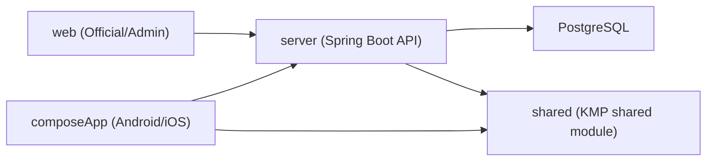

[](https://oguri-server-release.onrender.com)

<div align="center">
  <h1> 오구리</h1>
  <p><strong>연차를 가장 효율적으로 쓰는 방법을 제안하는 서비스</strong></p>
  <p>이번엔 이렇게 쉬어볼까요?</p>
</div>

## 오구리
오구리는 연차를 가장 효율적으로 쓰는 휴가 전략을 제안하는 서비스입니다.

- 모바일 앱: Kotlin Multiplatform + Compose Multiplatform (Android/iOS)
- 서버 API: Spring Boot + JPA + Flyway + PostgreSQL
- 웹: 공식 랜딩(`/`) + 어드민(`/admin`) React/Vite 앱

## 핵심 기능
- `Home`: 연차 사용 대비 가장 좋은 휴식 조합 추천
- `Calendar`: 카드 기반 추천 일정 탐색 + 무한 스크롤
- `MyPage`: 저장한 일정/여행지 및 연차 설정 관리
- `Admin Web`: 여행지/사용자/공휴일 데이터 관리, 이미지 업로드 및 정리

## 기술 스택
- Kotlin `2.3.0`
- Compose Multiplatform `1.10.0`
- Ktor `3.3.3` (모바일 네트워크 계층)
- Spring Boot `3.4.3` (서버)
- PostgreSQL + Flyway
- React `18` + Vite `6` (웹)

## 아키텍처


모바일 레이어 원칙:
- `data -> domain <- ui`
- `domain`은 외부 레이어에 의존하지 않음
- `ui`는 `domain`만 참조

## 프로젝트 구조
```text
.
├─ composeApp/   # KMP 모바일 앱 (Android/iOS 공용 UI 포함)
├─ iosApp/       # iOS 진입점(Xcode 프로젝트)
├─ server/       # Spring Boot API
├─ web/          # 공식 웹 + 어드민 웹
├─ shared/       # 공용 Kotlin 모듈
└─ guide/        # 팀 가이드(아키텍처/컨벤션/운영 문서)
```

## Contributors
|  |  |
|:---:|:---:|
| [공백(최준서)](https://github.com/junseo511) | [비비(장민정)](https://github.com/rosemin928) |

## Support Oguri
프로젝트가 마음에 드셨다면 이 저장소에 Star(⭐️)를 눌러주세요. 큰 힘이 됩니다.
